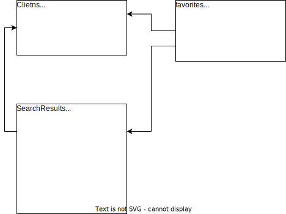

# VKinder

## Краткое описание:

Бот предлагает различные варианты людей для знакомств в социальной сети ВКонтакте в виде диалога с пользователем с чате сообщества.

Логика работы:

1. Отправляем сообщение "start" для начала работы с ботом
2. Нажимаем кнопку "Регистрация" - для регистрации клиента и получения ботом информации о вашем профиле

   * Бот используя информацию (возраст, пол, город) о пользователе, который общается с ботом в ВКонтакте, формирует поисковые критерии для поиска других пользователей ВКонтакте для знакомств.
3. По нажатию кнопки "Поиск" бот осуществляет выборку подходящих профилей ВК и показывает первый профиль в чате, выводя:

   * имя и фамилия
   * ссылка на профиль
   * три самые популярные фотографии в профиле (Популярность определяется по количеству лайков.)
4. Для того что бы  перейти к следующему человеку необходимо нажать кнопку "Следующий".
5. Так же доступн сохранить пользователя в список избранных выставив ему Like/Dislike.
6. Что бы вывести список избранных людей необходимо нажать кнопку "Избранное".

## Способ запуска

Для запуска приложения необходимо:

1. Склонировать GIT выполнив команду: 
   `git clone https://github.com/KostyaKovalenko2007/coursLAB.git`
2. Установить [docker](https://www.docker.com/)
3. Выпустить необходимые токены:

   1. токен для Сообщества ВКонтакт, выполнив [инструкцию](https://docs.google.com/document/d/1_xt16CMeaEir-tWLbUFyleZl6woEdJt-7eyva1coT3w/edit?usp=sharing).
   2. токен для ВК приложения можно получить выполнив [инструкцию](https://docs.google.com/document/d/1_xt16CMeaEir-tWLbUFyleZl6woEdJt-7eyva1coT3w/edit?usp=sharing). Важно: ри запросе токена необходимо указать скоуп:**scope=65540** (разрешив обращение к фото и АПИ в любое время)
4. Создать файл "secret.env" в корне папки проекта, следующего содержания:

   token=%Вносим сюда токен из п.3.1%
   dsn=postgresql://vk_bot_lab:Qw123456@db/vkbot
   priv_token= %Вносим сюда токен из п.3.2%
5. Запускаем бота, выполнив команду:
   `docker-compose up -d`

## Структура данных:

### Описание таблиц

* Clients -  Таблица для хранения информации о зарегистрированных пользователях работающих с Ботом

  | Название  | Тип  | Назначение                                                                                   |
  | ----------------- | ------- | ------------------------------------------------------------------------------------------------------ |
  | id                | int     | внутренний идентификатор клиента                                         |
  | vkID              | varchar | ID профиля в ВК                                                                              |
  | creterias         | json    | выгрузка VK о профиле пользователя                                         |
  | current_search_id | int     | ID профиля из таблицей с результатами поиска для клиента |
* SearchResults - Таблица для хранения результатов поиска профилей VK по критериями клиента

  | Наименование | Тип  | Назначение                                                                               |
  | ------------------------ | ------- | -------------------------------------------------------------------------------------------------- |
  | id                       | int     | идентификатор (primary key)                                                           |
  | cientID                  | int     | ссылка (foreign key) на клиента (таблица clients)                            |
  | vkID                     | varchar | ИД профиля контакта найденного по поисковому запросу |
  | fio                      | varchar | ФИО найденного контакта                                                       |
  | img1                     | varchar | ссылка на изображение из профиля                                       |
  | img2                     | varchar | ссылка на изображение из профиля                                       |
  | img3                     | varchar | ссылка на изображение из профиля                                       |
* Favorites - Таблица для хранения отметок (Like/DisLike) пользователя

  | Наименование | Тип  | Назначение                                                                              |
  | ------------------------ | ------- | ------------------------------------------------------------------------------------------------- |
  | id                       | int     | внутренний идентификатор (primary key)                                     |
  | clientid                 | int     | ссылка (foreign key) на клиента (таблица clients)                           |
  | searchID                 | int     | ссылка (foreign key) на контакт из поиска (таблица SearchResults) |
  | like                     | boolean | Решение клиента True=Like / False=Dislike                                           |
